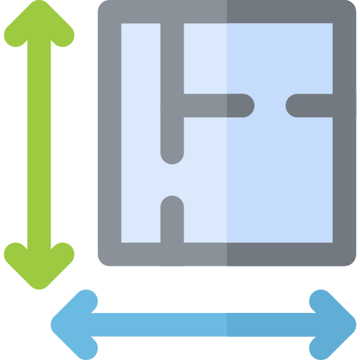

<!-- TITLE -->
<div align="center">

<h1>| Rehearsal Room |</h1>
<h3>Artists Looking For Space. Spaces Available For Artists.</h3>

<p>Built with <a href="https://reactjs.org/">React</a>, <a href="https://nodejs.org/en/">Node.js</a>, <a href="https://expressjs.com/">Express</a>, <a href="https://www.postgresql.org/">PostgreSQL</a>, <a href="https://storybook.js.org/">Storybook</a>, <a href="https://sass-lang.com/">SASS</a>, <a href="https://material-ui.com/">Material UI</a>, </p>
<p>using <a href="https://cloudinary.com/">Cloudinary</a> and <a href="https://developers.google.com/maps">Google Map</a> APIs</p>

</div>


# 💡 About

<b>Rehearsal Room</b> is a space finding app that connects artists with hidden gem studios, multipurpose rooms, basements, etc. in their local area. Built in the spirit of resource sharing, artists and community memebers can also host spaces themselves.

This app was created in a little over a week by <a href="https://github.com/KateIsabelle">Kate Davis</a>, <a href="https://github.com/MrinalN">Adele Noronha</a>, and <a href="https://github.com/itspladd">Paul Ladd</a> for our final projects in the <a href="https://www.lighthouselabs.ca/en/web-development-bootcamp">Lighthouse Labs Web Development Bootcamp.</a>

# 🌟 Features
- Users can browse spaces using filters
- Users can sign up for accounts, tracking booking requests in personalized dashboards
- Users can become Hosts, enabling property listings and managing request capabilities
- Spaces can be located through dynamic Google Map features
- Users can request booking using dynamic calendar and time slots

# 🧰 Installation
1. Git clone this repo:
  ```
  https://github.com/KateIsabelle/rehearsal-room
  ```

2. Open 2 terminal windows - client and server

3. On one window, navigate to rehearsal-room-backend and install dependencies:
  ```
  cd rehearsal-room-backend
  npm install
  ```
4. Run PostgreSQL command to set ad seed database:
  ```
  npm run db:reset
  ```
5. Start backend
  ```
  npm start
  ```
6. On another terminal window, navigate to rehearsal-room-frontend and install dependencies:
  ```
  cd rehearsal-room-frontend
  npm install
  ```
7. Start frontend
  ```
  npm start
  ```
8. Navigate to local:3000 in your browser (preferably Chrome) to checkout listings specifically populated for Vancouver


# 📷  Screenshots


# 💬 Et cetera 
- Checkout out Project [Planning](/planning)
  * [Erd](/planning/erd.md), [User_Stories](/planning/user_stories.md), [Wireframes](/planning/wireframe.md), [Routes](/planning/routes.md)

- [Acknowledgements](/planning/acknowledgements.md)
    
